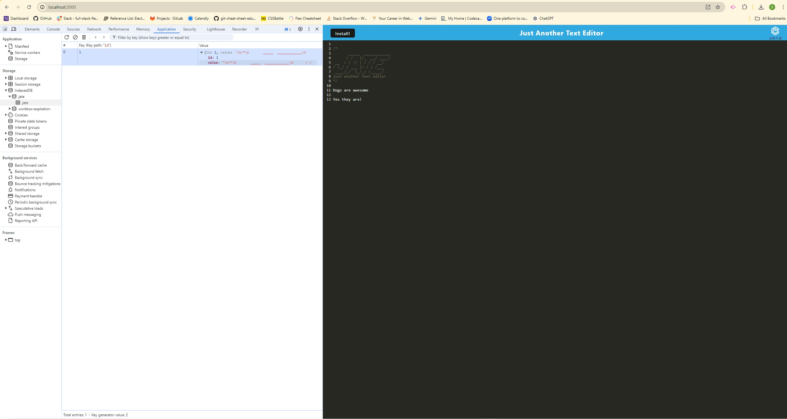

# Text-Editor-PWA
Module Challenge 19
# Just Another Text Editor (J.A.T.E)

## Description

J.A.T.E is a Progressive Web Application (PWA) text editor that runs in the browser. It is designed to allow developers to create notes or code snippets with or without an internet connection, providing reliable data persistence and offline functionality.

## Table of Contents

- [Installation](#installation)
- [Usage](#usage)
- [Features](#features)
- [Technologies Used](#technologies-used)
- [Screenshots](#screenshots)
- [Deployment](#deployment)
- [License](#license)
- [Contributing](#contributing)
- [Questions](#questions)

## Installation

To install and run the application locally, follow these steps:

1. Clone the repository:

        git clone https://github.com/yourusername/your-repo-name.git
        cd your-repo-name

2. Install dependencies:

        npm install
        cd client
        npm install
        cd ..

3. Start the development server: 

        npm run build        
        npm run start: dev 

## Usage
Open your browser and navigate to http://localhost:8080/. You can start typing your notes or code snippets. The content is automatically saved to IndexedDB when you click outside the editor. The application also works offline, and you can install it as a standalone app by clicking the "Install!" button.

## Features
* Offline Functionality: Works without an internet connection.
* Data Persistence: Automatically saves content to IndexedDB.
* Service Worker: Uses Workbox to cache static assets and enable offline access.
* Installable PWA: Can be installed as a standalone application on your device.
* CodeMirror Integration: Rich text editor with syntax highlighting and other features.

## Technologies Used
HTML
CSS
JavaScript
Webpack
Babel
IndexedDB (idb)
Workbox
CodeMirror
Node.js
Express.js

## Screenshots
Manifest File:

Registered Service Worker:

IndexedDB Storage:

## Deployment
The application is deployed to Render. You can access it via the following URL:

Deployed Application: 

## License
This project is licensed under the MIT License.

## Contributing
Contributions are welcome! Please fork the repository and create a pull request with your changes.

## Questions
If you have any questions or issues, feel free to open an issue in the repository or contact me directly at:

GitHub: [Sam Cowman](https://github.com/Sam-Cowman)
Email: sam.p.cowman@gmail.com